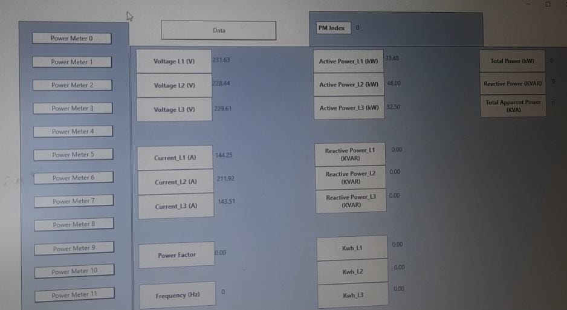

# Power Meter Data Monitoring and Visualization

## Project Overview
The **Power Meter Data Monitoring and Visualization** project leverages **Adisra SmartView** to read real-time data from a **Power Meter** PLC (Programmable Logic Controller) installed at a manufacturing company. The system captures key electrical parameters, including **Voltage** (L1, L2, L3), **Current** (L1, L2, L3), and **Power** (L1, L2, L3), and stores this data in a **SQL Server database** for historical analysis and future reporting.

In addition to the data collection, the project also integrates **real-time trend monitoring** via **Adisra SmartView**'s built-in graphical tools. The system provides a **visual representation** of the captured electrical parameters, allowing operators and engineers to track the health of the electrical system, identify irregularities, and ensure that the system operates efficiently.

## Visuals

### Power Meter Interface

## Key Features
- **Real-Time Data Capture**: Monitors and logs **Voltage** (L1, L2, L3), **Current** (L1, L2, L3), and **Power** (L1, L2, L3) values from the power meter.
- **Data Storage**: Captures real-time readings and stores them in an **SQL Server database** for further analysis or historical reference.
- **Trend Monitoring**: Visualizes electrical parameters over time using **Adisra SmartView**'s graphical trend feature, making it easier to detect fluctuations and potential issues.
- **Customizable Dashboard**: Provides an intuitive HMI dashboard for displaying the current status of the power system, with real-time updates of key electrical metrics.
- **Data Logging and Export**: The system supports **data logging** for maintaining a historical record of the electrical system’s performance. This data can also be exported for reporting or further analysis.

## Technologies and Tools Used
- **Adisra SmartView**: Used for reading real-time data from the power meter and displaying it through a graphical user interface (GUI).
- **SQL Server**: Used for storing and managing the collected data from the power meter, allowing for easy querying and data analysis.
- **Graphical Trend Display**: Utilized Adisra's built-in tools to create real-time graphs of key electrical parameters such as voltage, current, and power.
- **Data Monitoring**: Integrated the system with the power meter’s PLC to ensure data is continuously monitored and updated in real-time.

## System Workflow
1. **Data Capture**: The system continuously collects data from the power meter, including the **Voltage**, **Current**, and **Power** for each phase (L1, L2, L3).
2. **Data Logging**: Each reading is logged in the **SQL Server database**, ensuring that historical data is available for future analysis and reporting.
3. **Trend Display**: The collected data is visualized in **Adisra SmartView**, where users can see the current status of the electrical system through trend graphs.
4. **Real-Time Monitoring**: The system continuously updates the HMI dashboard with the latest data, providing live feedback on the power system’s health.

## Design Considerations
This project was designed to provide a **comprehensive solution** for real-time electrical data monitoring and trend analysis. By integrating **Adisra SmartView** with **SQL Server**, the system ensures that users have both real-time insights and historical data at their disposal. The system allows operators to quickly identify any abnormalities in the electrical parameters and take corrective actions to prevent failures or inefficiencies.

The trend monitoring feature plays a crucial role in this project, enabling **visual tracking** of the electrical system's health over time. This can help engineers and operators spot potential issues before they become critical.

## Setup and Usage Instructions
1. **Connect Power Meter**: Ensure the power meter is correctly connected to the PLC system and that it is able to communicate with Adisra SmartView.
2. **Adisra SmartView Setup**: Open Adisra SmartView and configure the data points for **Voltage**, **Current**, and **Power** (L1, L2, L3).
3. **Database Setup**: Set up a **SQL Server** database to store the data. Create necessary tables for capturing voltage, current, and power readings.
4. **Data Integration**: Configure Adisra SmartView to write the collected data to the SQL Server database in real-time.
5. **Visualize Trends**: Use Adisra’s graphical tools to create trend displays for each parameter (voltage, current, power) over time.

## Future Enhancements
- **Alert System**: Integrate an alert system to notify operators when the readings go outside predefined thresholds (e.g., if the voltage or current exceeds safe limits).
- **Cloud Integration**: Enable cloud storage for the data, providing access to historical data from any location.
- **Predictive Maintenance**: Implement machine learning algorithms that analyze historical data and predict possible system failures or maintenance needs based on trends.
- **Mobile App Access**: Develop a mobile app that allows remote monitoring of the electrical parameters, ensuring on-the-go access to the system’s status.

## License
This project is licensed under the **MIT License**, which allows for free use, modification, and distribution of the code.
